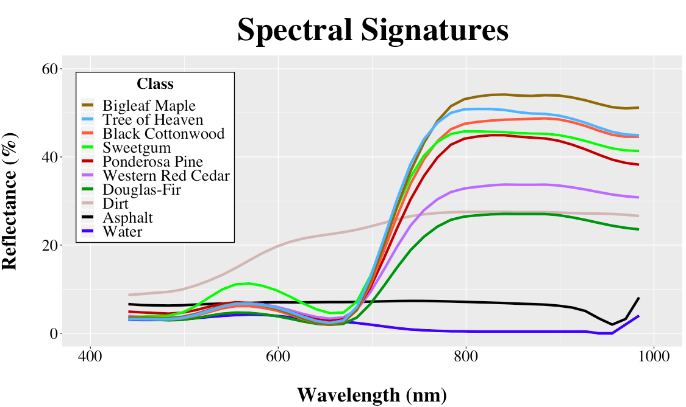
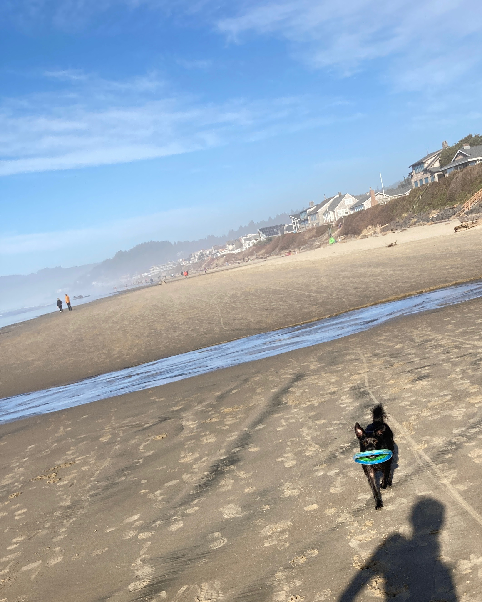

<link rel="stylesheet" href="styles.css" type="text/css" />

</head>

<body>

<!-- tabsets -->

<!-- code folding -->

<h1 class="title toc-ignore">Lauren Sharwood</h1>
<h4 class="author"><em>Remote Sensing Analyst</em></h4>

<h2>Hi there!</h2>
<html>
<head>

</head>
<body>

I’m Lauren (she/her), a Remote Sensing Analyst with a M.S. in Geography and 6+ years experience working with GIS. I currently live in Portland, OR and enjoy exploring the PNW with my pandemic pup, Ruthie.   I’m passionate about integrating geospatial data products and machine learning algorithms to monitor the environment. As an aspiring polymath, I’m always challenging myself to learn new skills and techniques.    

</body>
</html>

<h3>Resume</h3>

<h3>Research Projects</h3>
<ul>
<li>
Master’s Thesis (2021): <a href="https://pdxscholar.library.pdx.edu/cgi/viewcontent.cgi?article=6946&amp;context=open_access_etds"><strong>Modeling Environmental Factors Related to Drought-Induced Tree Mortality Based on Lidar and Hyperspectral Imagery</strong></a>  
</li>
<li>
Spatial Quantitative Analysis II Lab Presentation (2018): <a href="https://web.pdx.edu/~lshar2/Geog597/597_SharwoodL_Lab7.html#/"><strong>Random Forest Classification</strong></a>  
</li>
<li>
Spatial Quantitative Analysis II Lab Presentation (2018): <a href="https://web.pdx.edu/~lshar2/Geog597/597_SharwoodL_Labs5_6.html#/"><strong>Spatial Hedonic Regression</strong></a>  
</li>
<li>
Remote Sensing of the Environment III Research Project Poster (2016):   
</li>
<li>
Geographic Information Systems III Research Project Poster (2016): 
</li>
</ul>

<h3>Spectral Plotter</h3>

Average reflectance values for a handful of tree crown training polygons extracted using the ENVI ROI Tool. Mean relflectance as a function of VNIR wavelengths plot in R using ggplot:

    

<h3>Web Mapping Fun</h3>

Interactive Leaflet web map I’m making of some of my favorite restaurants, coffee shops, and breweries around PDX:

<iframe title="My Map" width="980" height="400" src=" https://github.com/laurensharwood/laurensharwood.github.io/pdx_bars.html" frameborder="0" allowfullscreen>
</iframe>

<h3>There Goes My Baby&amp;I API</h3>

Ruthie’s running routes collected through Strava API (incoming…)   

<h3>Contact</h3>

<a href="https://www.linkedin.com/in/lauren-sharwood-902677140/"><strong>Linkedin</strong></a>   <a href="mailto:laurensharwood13@gmail.com">laurensharwood13@gmail.com</a>

<!-- dynamically load mathjax for compatibility with self-contained -->

</body>
</html>
